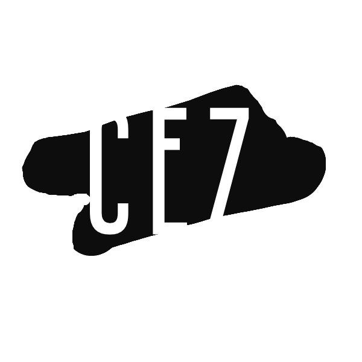

<p align="center">
  
</p>

<h1 align="center">Язык программирования Cez</h1>

<p align="center">
  <b>Системный язык нового поколения: лаконичность Go + аппаратная мощь C/Zig + 100% детерминированный самохостинг</b>
</p>

<p align="center">
  <a href="docs/LANGUAGE.md">Спецификация языка</a> •
  <a href="docs/OSDEV.md">Руководство по OSDev</a> •
  <a href="docs/BENCHMARKS_AND_COMPARISON.md">Сравнение и 10 Топов</a>
</p>

---

## О языке Cez

**Cez** создавался с главной целью: дать разработчикам **удовольствие и скорость написания кода уровня Go**, но без скрытых пауз сборщика мусора, без навязанного рантайма и с абсолютным аппаратным контролем, необходимым для **разработки операционных систем (OSDev)**, гипервизоров, драйверов и экстремально быстрых серверов.

### Ключевые преимущества:
1. **Эргономика Go**: вывод типов (`:=`), отсутствие круглых скобок в `if`/`for`, автоматические точки с запятой (ASI), чистый LIFO `defer` для освобождения ресурсов, структуры с методами `(p *Point) Move(...)`.
2. **Первоклассный OSDev / Bare-Metal**:
   - `@packed` структуры для аппаратных таблиц (IDT, GDT, TSS, Page Tables).
   - `@align(N)` для выравнивания страниц (4096 байт).
   - `@section(".multiboot")` для размещения данных в секциях ELF.
   - `@naked` функции без прологов/эпилогов для прерываний и переключения контекста.
   - `inline_asm` и прямой доступ к MMIO/VGA памяти (`0xB8000`).
3. **Числа с плавающей точкой**: нативная поддержка `f32` (float) и `f64` (double), математических выражений и приведений типов.
4. **Гибридная модель памяти**:
   - Стек (нулевой оверхед).
   - Быстрые bump-арены памяти `O(1)` ([`core/mem.cez`](core/mem.cez)).
   - Прямое управление памятью (`malloc` / `free`).
   - Опциональный сборщик мусора ([`core/gc.cez`](core/gc.cez)), включенный по умолчанию для прикладного софта и отключаемый для ядра ОС.
5. **100% Self-Hosting**: компилятор полностью написан на самом Cez и компилирует сам себя бит-в-бит (Stage 2 = Stage 3 детерминированно).
6. **Локализация CLI (i18n)**: полная поддержка вывода всех команд компилятора на 3 языках: **английский** (`en`), **русский** (`ru`) и **украинский** (`uk`) — автоопределение по системной локали, `$CEZ_LANG` или флагу `--lang=<en|ru|uk>`.
7. **Инструменты разработчика**: встроенный легковесный LSP-сервер (`cez lsp`) и расширение для редактора **Zed** ([`editors/zed/`](editors/zed/)).

---

## Быстрый старт

### Сборка компилятора:
```bash
# Начальный бутстрап через Rust:
cargo build --release

# Сборка самохостящегося компилятора bin/cez:
cargo run --release -- build core/mem.cez core/os.cez compiler/*.cez -o bin/cez-stage1
./bin/cez-stage1 core/mem.cez core/os.cez compiler/*.cez -o bin/cez
```

### Запуск примеров:
```bash
# Приветственный пример с defer и функциями
./bin/cez examples/hello.cez -o /tmp/hello && /tmp/hello

# Сетевой серверный парсер пакетов с @packed
./bin/cez examples/server_packet.cez -o /tmp/packet && /tmp/packet

# TUI-интерфейс мониторинга
./bin/cez examples/tui_dashboard.cez -o /tmp/tui && /tmp/tui

# Сборка Bare-Metal Multiboot ядра ОС без libc
./bin/cez examples/kernel_multiboot.cez -o /tmp/kernel.o
```

---

## Пример кода на Cez

```go
package main

extern func puts(s *i8) i32
extern func printf(fmt *i8, ...) i32

type Vector2 struct {
    x f64
    y f64
}

func (v *Vector2) LengthSq() f64 {
    return v.x * v.x + v.y * v.y
}

func main() int {
    defer puts("Выполнено гарантированно в порядке LIFO!")

    v := Vector2{ x: 3.0, y: 4.0 }
    lsq := v.LengthSq() // 25.0

    if lsq == 25.0 {
        puts("[OK] Расчет длины вектора через f64 прошел успешно")
    }

    return 0
}
```

---

## Тестовый набор компилятора (14 тестов)

Все тесты компилируются самохостящимся компилятором `bin/cez` и проходят со статусом PASS:

| Тест | Описание |
|---|---|
| [`tests/01_arithmetic.cez`](tests/01_arithmetic.cez) | Целочисленная арифметика и побитовые операции (`&`, `\|`, `^`, `<<`, `>>`) |
| [`tests/02_control_flow.cez`](tests/02_control_flow.cez) | Ветвления `if` / `else if` / `else`, логические операции |
| [`tests/03_loops.cez`](tests/03_loops.cez) | Циклы `for` (3-секционные, while-стиль, бесконечные, `break`, `continue`) |
| [`tests/04_functions.cez`](tests/04_functions.cez) | Функции, рекурсия (факториал, Фибоначчи, Аккерман) |
| [`tests/05_structs.cez`](tests/05_structs.cez) | Структуры, вложенные поля, методы с receiver-указателем |
| [`tests/06_pointers.cez`](tests/06_pointers.cez) | Указатели `*p`, `&x`, swap, двойные указатели `**pp`, `uintptr` |
| [`tests/07_arrays.cez`](tests/07_arrays.cez) | Статические массивы `[10]int`, индексация, in-place реверс |
| [`tests/08_strings.cez`](tests/08_strings.cez) | Строковые литералы, escape-последовательности, `StrLen`, `StrEq` |
| [`tests/09_defer.cez`](tests/09_defer.cez) | LIFO вызов `defer`, ранний `return` |
| [`tests/10_globals_and_consts.cez`](tests/10_globals_and_consts.cez) | Глобальные переменные `var`, константы `const`, затенение |
| [`tests/11_memory_arena.cez`](tests/11_memory_arena.cez) | Арена памяти, связный список, выравнивание, сброс арены |
| [`tests/12_type_casts.cez`](tests/12_type_casts.cez) | Приведения типов (`u8`, `u16`, `u32`, `int`, `uintptr`), little-endian |
| [`tests/13_floating_point.cez`](tests/13_floating_point.cez) | Вещественные числа `f32` и `f64`, арифметика, сравнения, касты |
| [`tests/14_garbage_collector.cez`](tests/14_garbage_collector.cez) | Опциональный Mark-and-Sweep сборщик мусора ([`core/gc.cez`](core/gc.cez)) |

---

## Документация проекта

* **[Спецификация языка (docs/LANGUAGE.md)](docs/LANGUAGE.md)** — полное описание синтаксиса, типов и семантики.
* **[Разработка ОС (docs/OSDEV.md)](docs/OSDEV.md)** — создание загрузчиков, IDT/GDT, обработчиков прерываний и MMIO.
* **[Сравнение и 10 Топов (docs/BENCHMARKS_AND_COMPARISON.md)](docs/BENCHMARKS_AND_COMPARISON.md)** — детальный анализ преимуществ Cez перед C, C++, Rust, Zig, Odin, Go.
